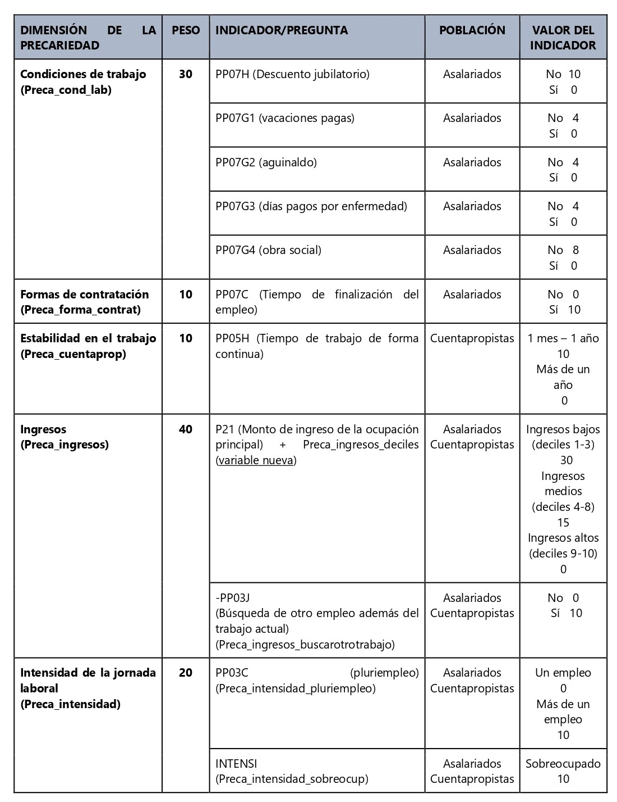

```{r setup, include=FALSE}
knitr::opts_chunk$set(
	echo = FALSE, #con esto no se muestra código en el informe
	message = FALSE, #con esto no se muestran mjes 
	warning = FALSE #ni advertencias
)
```

```{r librerias, include=FALSE}
library(eph)
library(tidyverse)
library(dplyr)
library(janitor)
library(srvyr)
library(haven)
library(kableExtra)
library(ggplot2)
library(scales)
library(ggthemes)
library(RColorBrewer)
library(knitr)
library(webshot)
library(rmarkdown)
```

```{r base, echo=FALSE}

EPH2019_2023CAES <- readRDS("EPH2019_2023CAES.rds")
```

## Introducción

En este trabajo nos proponemos analizar la dinámica de la precariedad laboral a partir de la EPH individual. Tomamos como referencia el tercer trimestre del período 2019-2023 para el total de aglomerados urbanos. Entendemos que este fenómeno es multidimensional y está atravesado por las heterogeneidades del mundo del trabajo.

En función de esta premisa, analizaremos cómo está compuesta la población en la sección [Descripción de la población de la muestra]. Nos referiremos en particular a la edad, la condición sexo genérica, el origen étnico nacional y el nivel educativo. En segundo lugar, contemplamos una serie de dimensiones que contribuyen a configurar ámbitos laborales diferenciados, tales como la categoría ocupacional, el sector de actividad, el tipo de empleador (público o privado), el tamaño del establecimiento donde se desempeñan los trabajadores, entre otras. Consideramos que estos aspectos inciden diferencialmente en la precariedad laboral.

Luego, en [La precariedad como fenómeno multidimensional] presentaremos un índice de precariedad de laboral que se compone de cuatro dimensiones constitutivas: las condiciones laborales, el grado de estabilidad laboral, los ingresos y el nivel de intensidad laboral. Finalmente, en la sección [Análisis de la precariedad] presentamos un análisis que entrecruza el índice de precariedad laboral con las variables presentadas al inicio.

## Descripción de la población de la muestra

A continuación, analizamos cómo se compone la población de la muestra, tomando como referencia aquellas variables que consideramos especialmente relevantes para en el análisis de la precariedad.

## Variables demográficas {.tabset}

### Sexo

Aproximadamente el 51% son mujeres y el 48% son varones, distribución que, con pequeñas variaciones (51,3 al 51,7 y 48,3 al 48,7), se mantiene a lo largo del período analizado.

```{r muestra sexo, echo=FALSE}
graf_sexoyaño <- ggplot(EPH2019_2023CAES, aes(x = ANO4, y = PONDERA, fill = SEXO)) + 
  geom_bar(stat = "identity", position = "fill") + 
  scale_fill_brewer(palette="Set3")+
  labs(title = "Sexo de la población por año",
       subtitle = "Total de 31 aglomerados. Terceros trimestres de 2019-2023",
       x = "Año",
       y = "Población") +
  theme_calc() +
  scale_y_continuous(labels = scales::percent_format(accuracy = 1)) +
  guides(size = "none")

print(graf_sexoyaño)
```

### Grupos etarios

Identificamos tres grupos etarios: de 16 a 30 años, de 31 a 50 y de 51 o más. El primer grupo ronda el 30% del total de la población de la muestra; el segundo y el tercero, entre el 33 y 36%

```{r muestra grupos etarios, echo=FALSE}
gruposetarios_año_pond <- EPH2019_2023CAES %>% filter (!is.na(grupos_etarios)) %>% 
  group_by(ANO4, grupos_etarios) %>% 
  summarize(casos = sum(PONDERA)) %>% 
  mutate(Porcentaje = round((casos / sum(casos)) * 100, 1))

gruposetarios_año_pond <- gruposetarios_año_pond %>%
  mutate(
    ANO4 = as_factor(ANO4),  # Convertir año a factor
   casos = as.numeric(casos),  # Asegurar que casos sea numérico
    grupos_etarios = as_factor(grupos_etarios)  # Convertir la variable de grupos etarios a factor
  ) %>%
  group_by(ANO4) %>%
  mutate(porcentaje = casos / sum(casos)) %>%  # Calcular proporciones dentro de cada año
  ungroup()

graf_gruposetarios <- ggplot(gruposetarios_año_pond, aes(x = ANO4, y = porcentaje, fill = grupos_etarios)) + 
  geom_bar(stat = "identity", ) +  
  scale_fill_brewer(palette = "Set3") +  # Paleta de colores
  labs(title = "Distribución de grupos etarios por año",
       subtitle = "Total de 31 aglomerados. Terceros trimestres de 2019-2023",
       x = "Año",
       y = "Población") +
  theme_calc() +
  scale_y_continuous(labels = scales::percent_format(accuracy = 1)) +  
  guides(size = "none")+
  geom_text(aes(label = scales::percent(porcentaje, accuracy = 1)),
            position = position_stack(vjust = 0.5),  # Centrar las etiquetas en las pilas
            color = "black", fontface = "bold", size = 3)

print(graf_gruposetarios)
```

### Lugar de nacimiento

Entre un 82 y 85 % de la población trabaja en la misma provincia en la que nació. Los migrantes internos representan entre un 10 y 12%, mientras que la población migrante tiene una presencia todavía menor en los datos relevados: aproximadamente entre el 3 y el 5%, siendo en su mayoría proveniente de países limítrofes

```{r muestra lugar nacimiento}
lugarnacimiento_año_pond <- EPH2019_2023CAES %>% filter(!is.na(lugar_nacimiento)) %>% 
  group_by(ANO4, lugar_nacimiento) %>% 
  summarize(casos = sum(PONDERA)) %>% 
  mutate(Porcentaje = round((casos / sum(casos)) * 100, 1))

lugarnacimiento_año_pond <- lugarnacimiento_año_pond %>%
  mutate(
    ANO4 = as_factor(ANO4),  # Convertir año a factor
    casos = as.numeric(casos),  # Asegurar que casos sea numérico
    lugar_nacimiento = as_factor(lugar_nacimiento)  # Convertir la variable lugar_nacimiento a factor
  ) %>%
  group_by(ANO4) %>%
  mutate(porcentaje = casos / sum(casos)) %>%  # Calcular proporciones dentro de cada año
  ungroup()

# Crear gráfico de barras apiladas
graf_lugar_nacimiento <- ggplot(lugarnacimiento_año_pond, aes(x = ANO4, y = porcentaje, fill = lugar_nacimiento)) + 
  geom_bar(stat = "identity") +
  scale_fill_brewer(palette = "Set3") +  # Paleta de colores
  labs(title = "Lugar de nacimiento por año",
       subtitle = "Total de 31 aglomerados. Terceros trimestres de 2019-2023",
       x = "Año",
       y = "Población") +
  theme_calc() +
  scale_y_continuous(labels = scales::percent_format(accuracy = 1)) +  # Mostrar en porcentaje
  guides(size = "none")+
  geom_text(aes(label = scales::percent(porcentaje, accuracy = 1)),
            position = position_stack(vjust = 0.5),  
            color = "#313332", fontface = "bold", size = 2.5)
print(graf_lugar_nacimiento)
```

### Nivel educativo alcanzado

En relación con el nivel educativo alcanzado, podemos señalar que hacia el final de la serie se incrementa en dos puntos porcentuales la población que ha culminado el nivel secundario. Entre 2021 y 2023, a su vez, aumenta en un punto la población universitaria.

```{r muestra nivel educativo, echo=FALSE}
nivel_educativo_año_pond <- EPH2019_2023CAES %>% filter(!is.na(nivel_educativo_completo)) %>% 
  group_by(ANO4, nivel_educativo_completo) %>% 
  summarize(casos = sum(PONDERA)) %>% 
  mutate(Porcentaje = round((casos / sum(casos)) * 100, 1))

# Convertir variables adecuadas y calcular proporciones dentro de cada año
nivel_educativo_año_pond <- nivel_educativo_año_pond %>%
  mutate(
    ANO4 = as_factor(ANO4),  # Convertir año a factor
    casos = as.numeric(casos),  # Asegurar que casos sea numérico
    nivel_educativo_completo = as_factor(nivel_educativo_completo)  # Convertir la variable lugar_nacimiento a factor
  ) %>%
  group_by(ANO4) %>%
  mutate(porcentaje = casos / sum(casos)) %>%  # Calcular proporciones dentro de cada año
  ungroup()

# Crear gráfico de barras apiladas
graf_nivel_educativo <- ggplot(nivel_educativo_año_pond, aes(x = ANO4, y = porcentaje, fill = nivel_educativo_completo)) + 
  geom_bar(stat = "identity") +
  scale_fill_brewer(palette = "Set3") +  # Paleta de colores
  labs(title = "Nivel educativo completo por año",
       subtitle = "Total de 31 aglomerados. Terceros trimestres de 2019-2023",
       x = "Año",
       y = "Población") +
  theme_calc() +
  scale_y_continuous(labels = scales::percent_format(accuracy = 1)) +  # Mostrar en porcentaje
  guides(size = "none")+
  geom_text(aes(label = scales::percent(porcentaje, accuracy = 1)),
            position = position_stack(vjust = 0.5),  
            color = "#313332", fontface = "bold", size = 2.5)
print(graf_nivel_educativo)
```

## Variables laborales {.tabset}

### Condición de actividad

El porcentaje de población ocupada se mantiene constante entre los años 2019 y 2021. Hacia 2023 la cantidad de población aumenta dos puntos porcentuales. La contraparte es la reducción de la población inactiva y desocupada.

```{r}
cond_actividad_pond <- EPH2019_2023CAES %>% 
  group_by(ANO4, ESTADO) %>% 
  summarize(casos = sum(PONDERA)) %>% 
  mutate(Porcentaje = round((casos / sum(casos)), 2),
        Condición_actividad = case_when(
    ESTADO== 1 ~ "Ocupado/a",
    ESTADO == 2 ~ "Desocupado/a",
    ESTADO == 3 ~ "Inactivo/a",
    ESTADO == 4 ~ "Menor de 10 anos",
    TRUE ~ "Otro"  # Para manejar cualquier otro valor posible
  )) 
cond_actividad_pond_acotada = cond_actividad_pond %>% 
  select(-casos, -ESTADO) 

graf_cond_actividad <- ggplot(cond_actividad_pond_acotada, aes(x = ANO4, y = Porcentaje, fill = Condición_actividad)) + 
  geom_bar(stat = "identity", position = "fill") +
  coord_flip() +
  scale_fill_brewer(palette = "Set3") +  # Paleta de colores
  labs(title = "Codición de actividad por año",
       subtitle = "Total de 31 aglomerados. Terceros trimestres de 2019-2023",
       x = "Año",
       y = "Población") +
  theme_calc() +
  scale_y_continuous(labels = scales::percent_format(accuracy = 0.1)) +  # Mostrar en porcentaje
  guides(size = "none")+
  geom_text(aes(label = scales::percent(Porcentaje, accuracy = 0.1)),
            position = position_stack(vjust = 0.5),  
            color = "#313332", fontface = "bold", size = 2.5)
print(graf_cond_actividad)
```

### Categoría ocupacional

Tras una contracción en el tercer trimestre de 2020 y 2021, la cantidad de asalariados en relación con el total de ocupados comenzó a crecer: hacia 2023 el 74,2% se los ocupados era asalariado. También la cantidad de ocupados/as que se define como patrón se incrementó levemente hacia 2023. Los ocupados por cuenta propia crecieron en términos absolutos y relativos entre 2019 y 2021; desde ese momento, su magnitud se mantuvo estable y se achicó sutilmente.

```{r echo=FALSE}

table(EPH2019_2023CAES$CAT_OCUP)

categ_ocupacional_pond = EPH2019_2023CAES %>% 
  filter(ESTADO == 1) %>% 
  group_by(ANO4, CAT_OCUP) %>% 
  summarize(casos = sum(PONDERA, na.rm = TRUE)) %>% 
  mutate(Porcentaje = round((casos / sum(casos)) * 100, 2),
        Categoría_ocupacional = case_when(
    CAT_OCUP== 1 ~ "Patrón",
    CAT_OCUP == 2 ~ "Cuenta propia",
    CAT_OCUP == 3 ~ "Obrero o empleado",
    CAT_OCUP == 4 ~ "Trabajador familiar sin remuneración",
    TRUE ~ NA  
  ))

categ_ocupacional_pond_filtrada <- categ_ocupacional_pond %>%
  filter(!is.na(Categoría_ocupacional))

graf_cat_ocup <- ggplot(categ_ocupacional_pond_filtrada, aes(x = ANO4, y = Porcentaje, fill = Categoría_ocupacional)) + 
  geom_bar(stat = "identity", position = "fill") +
  coord_flip() +
  scale_fill_brewer(palette = "Set3") +  
  labs(title = "Categoría ocupacional por año (Total ocupados)",
       subtitle = "Total de 31 aglomerados. Terceros trimestres de 2019-2023",
       x = "Año",
       y = "Población") +
  theme_calc() +
  scale_y_continuous(labels = scales::percent_format(accuracy = 0.01)) +  # Mostrar en porcentaje
  guides(size = "none")
   
print(graf_cat_ocup)
```

### Ámbito del establecimiento

La preeminencia de la ocupación en el sector privado en el período seleccionado es evidente, aunque es posible notar que entre 2019 y 2021 la proporción de ocupados/as en el sector público se incrementa mientras que en 2022 se contrae. En cuanto a las personas en actividad en el sector privado, la tendencia es creciente de 2021 en adelante.

```{r}
ambitoestablecimiento_año_pond <- EPH2019_2023CAES %>% 
  filter(!is.na(ambito_establecimiento)) %>% 
  group_by(ANO4, ambito_establecimiento) %>% 
  summarize(casos = sum(PONDERA))

ambitoestablecimiento_año_pond <- ambitoestablecimiento_año_pond %>%
  mutate(
    ANO4 = as_factor(ANO4),  
    casos = as.numeric(casos),  
    ambito_establecimiento = as_factor(ambito_establecimiento)  
  ) %>%
  group_by(ANO4) %>%
  mutate(porcentaje = casos / sum(casos)) %>%  
  ungroup()

graf_ambitoestablecimiento <- ggplot(ambitoestablecimiento_año_pond, aes(x = ANO4, y = porcentaje, fill = ambito_establecimiento)) + 
  geom_bar(stat = "identity") +
  scale_fill_brewer(palette = "Set3") +  
  labs(title = "Ambito del establecimiento de trabajo por año (Total ocupados)",
       subtitle = "Total de 31 aglomerados. Terceros trimestres de 2019-2023",
       x = "Año",
       y = "Población") +
  theme_calc() +
  scale_y_continuous(labels = scales::percent_format(accuracy = 1)) +  # Mostrar en porcentaje
  guides(size = "none")+
  geom_text(aes(label = scales::percent(porcentaje, accuracy = 0.1)),
            position = position_stack(vjust = 0.5),  
            color = "#313332", fontface = "bold", size = 2.5)
print(graf_ambitoestablecimiento)

```

## Tasas básicas del Mercado de trabajo en el período 2019-2023 (VER)

*Con respecto a las variables vinculadas a la dinámica del mercado de trabajo, vemos que la tasa de empleo sufre una caída significativa en el primer año de pandemia (2020) de cinco puntos porcentuales(de 42,6, a 37,4 %), para luego recuperar alrededor de 8 puntos y alcanzar al 45,5% de la población para el tercer trimestre de 2023. El correlato de este comportamiento puede observarse tanto en el crecimiento de la desocupación (de un 9,7 a un 11,7%) como de la inactividad en ese mismo año (del 52,5% al 57,4%), situación que se revierte progresivamente hacia 2023. Así, la desocupación para el total urbano llega a un piso de 5,7% y la inactividad desciende hasta el 51,5%.\
De este modo, el crecimiento de la tasa de empleo desempeña un papel significativo en el incremento de la tasa de actividad que puede observarse tras la abrupta caída de 2020.*

```{r}
Datos_MT_1923 <- EPH2019_2023CAES %>%  
  group_by(ANO4) %>% 
  summarize(
    Poblacion          = sum(PONDERA),
    Ocupados          = sum(PONDERA[ESTADO == 1]),
    Desocupados       = sum(PONDERA[ESTADO == 2]),
    PNEA               = sum(PONDERA[ESTADO %in% c(3, 4)]), 
    PEA                = Ocupados + Desocupados,
    Ocupados_demand   = sum(PONDERA[ESTADO == 1 & PP03J == 1]),
    Suboc_demandante  = sum(PONDERA[ESTADO == 1 & INTENSI == 1 & PP03J == 1]),
    Suboc_no_demand   = sum(PONDERA[ESTADO == 1 & INTENSI == 1 & PP03J %in% c(2, 9)]),
    Subocupados       = Suboc_demandante + Suboc_no_demand,
    'Tasa Actividad'  = (PEA / Poblacion) * 100,
    'Tasa Inactividad' = (PNEA / Poblacion) * 100,
    'Tasa Empleo'     = (Ocupados / Poblacion) * 100,
    'Tasa Desocupacion' = (Desocupados / PEA) * 100,
    'Tasa ocupados demandantes' = (Ocupados_demand / PEA) * 100,
    'Tasa Subocupación' = (Subocupados / PEA) * 100,
    'Tasa Subocupación demandante' = (Suboc_demandante / PEA) * 100,
    'Tasa Subocupación no demandante' = (Suboc_no_demand / PEA) * 100
  ) %>%
  # Redondear las tasas a 1 decimal
  mutate(across(starts_with("Tasa"), ~ round(., 1)))

TasasMT_1923 <- Datos_MT_1923 %>% select(ANO4, 'Tasa Actividad', 'Tasa Inactividad', 'Tasa Empleo','Tasa Desocupacion','Tasa Subocupación')


TablaTasasMT <- TasasMT_1923 %>%
  kable(booktabs = TRUE,          
        caption = "<b>Principales tasas del mercado de trabajo. Total de 31 aglomerados urbanos. 3T-2019-2023</b>", 
        align = c('l','c','c','c'), 
        col.names = c("Año", 
                      "Tasa de actividad", 
                      "Tasa de inactividad", 
                      "Tasa de empleo", 
                      "Tasa de desocupación", 
                      "Tasa de subocupación")) %>%   
  kable_styling(bootstrap_options = c("striped", "hover", "condensed", "bordered"), 
                full_width = T, 
                position = "center") %>% 
  row_spec(0, bold = TRUE, background = "#4dd686", color = "white") %>%
  row_spec(seq(1, nrow(TasasMT_1923), 2), background = "#F5F5F5") %>% 
  column_spec(1, bold = TRUE) %>% 
  footnote(symbol = "Elaboración propia en base a EPH-INDEC")
 
TablaTasasMT

```

### Tasas básicas desagregadas {.tabset}

#### Sexo

Durante el período 2019-2023, el nivel de ocupación en la población femenina presenta un rezago respecto de la población masculina de entre 11 y 16 puntos porcentuales. Es interesante observar que en los años inmediatamente posteriores a la pandemia, esta brecha se incrementa significativamente en relación a los años precedentes. Este fenómeno puede estar relacionado a la sobrecarga de trabajo de cuidado doméstico y familiar que recayó sobre las mujeres producto de las restricciones a la circulación.

Complementariamente, es importante considerar que entre 2019 y 2023 la condición de desempleo es más extendida entre las mujeres, ubicándose entre 1 a 5 puntos porcentuales por encima del desempleo masculino.

La brecha de género más significativa se encuentra en relación a la condición de inactividad. En todos los años, **el porcentaje de inactividad para mujeres supera el de la ocupación, mientras que para varones ocurre el fenómeno contrario: la condición de ocupados siempre se mantiene por encima de la condición de inactividad.**

```{r echo=FALSE}
TASAS_MT_SEXO_1923 <- EPH2019_2023CAES %>%  
  group_by(ANO4, SEXO) %>% 
  summarize(
    Poblacion          = sum(PONDERA),
    Ocupados          = sum(PONDERA[ESTADO == 1]),
    Desocupados       = sum(PONDERA[ESTADO == 2]),
    PNEA               = sum(PONDERA[ESTADO %in% c(3, 4)]), 
    PEA                = Ocupados + Desocupados,
    Ocupados_demand   = sum(PONDERA[ESTADO == 1 & PP03J == 1]),
    Suboc_demandante  = sum(PONDERA[ESTADO == 1 & INTENSI == 1 & PP03J == 1]),
    Suboc_no_demand   = sum(PONDERA[ESTADO == 1 & INTENSI == 1 & PP03J %in% c(2, 9)]),
    Subocupados       = Suboc_demandante + Suboc_no_demand,
    'Tasa Actividad'  = (PEA / Poblacion) * 100,
    'Tasa Inactividad' = (PNEA / Poblacion) * 100,
    'Tasa Empleo'     = (Ocupados / Poblacion) * 100,
    'Tasa Desocupacion' = (Desocupados / PEA) * 100,
    'Tasa ocupados demandantes' = (Ocupados_demand / PEA) * 100,
    'Tasa Subocupación' = (Subocupados / PEA) * 100,
    'Tasa Subocupación demandante' = (Suboc_demandante / PEA) * 100,
    'Tasa Subocupación no demandante' = (Suboc_no_demand / PEA) * 100
  ) %>%
  # Redondear las tasas a 1 decimal
  mutate(across(starts_with("Tasa"), ~ round(., 1)))

TasasMT_SEXO_SELECTED <- TASAS_MT_SEXO_1923 %>% select(ANO4, SEXO, 'Tasa Actividad', 'Tasa Inactividad', 'Tasa Empleo','Tasa Desocupacion','Tasa Subocupación')
TablaTasasMT_SEXO <- TasasMT_SEXO_SELECTED %>%
  kable(booktabs = TRUE,          
        caption = "<b>Principales tasas del mercado de trabajo según sexo. Total de 31 aglomerados urbanos. 3T-2019-2023</b>", 
        align = c('l','c','c','c'), 
        col.names = c("Año", 
                      "Sexo",
                      "Tasa de actividad", 
                      "Tasa de inactividad", 
                      "Tasa de empleo", 
                      "Tasa de desocupación", 
                      "Tasa de subocupación")) %>%   
 kable_styling(bootstrap_options = c("striped", "hover", "condensed", "bordered"), 
                full_width = T, 
                position = "center") %>% 
  row_spec(0, bold = TRUE, background = "#4dd686", color = "white") %>%
  row_spec(seq(1, nrow(TasasMT_SEXO_SELECTED), 2), background = "#F5F5F5") %>% 
  collapse_rows(columns = 1, valign = "middle") %>%  
  column_spec(1, bold = TRUE) %>% 
  footnote(symbol = "Elaboración propia en base a EPH-INDEC")
TablaTasasMT_SEXO 


```

#### Grupos etarios

El grupo etario de 16 a 30 años es el que tiene mayores tasas de desempleo en relación con los demás. Es llamativo que, a partir del año 2023, la tasa de inactividad en este grupo etario disminuya tres puntos porcentuales, al mismo tiempo que se incrementa su tasa de empleo.

```{r}
TASAS_MT_gruposetarios_1923 <- EPH2019_2023CAES %>% filter(!is.na(grupos_etarios)) %>%  
  group_by(ANO4, grupos_etarios) %>% 
  summarize(
    Poblacion          = sum(PONDERA),
    Ocupados          = sum(PONDERA[ESTADO == 1]),
    Desocupados       = sum(PONDERA[ESTADO == 2]),
    PNEA               = sum(PONDERA[ESTADO %in% c(3, 4)]), 
    PEA                = Ocupados + Desocupados,
    Ocupados_demand   = sum(PONDERA[ESTADO == 1 & PP03J == 1]),
    Suboc_demandante  = sum(PONDERA[ESTADO == 1 & INTENSI == 1 & PP03J == 1]),
    Suboc_no_demand   = sum(PONDERA[ESTADO == 1 & INTENSI == 1 & PP03J %in% c(2, 9)]),
    Subocupados       = Suboc_demandante + Suboc_no_demand,
    'Tasa Actividad'  = (PEA / Poblacion) * 100,
    'Tasa Inactividad' = (PNEA / Poblacion) * 100,
    'Tasa Empleo'     = (Ocupados / Poblacion) * 100,
    'Tasa Desocupacion' = (Desocupados / PEA) * 100,
    'Tasa ocupados demandantes' = (Ocupados_demand / PEA) * 100,
    'Tasa Subocupación' = (Subocupados / PEA) * 100,
    'Tasa Subocupación demandante' = (Suboc_demandante / PEA) * 100,
    'Tasa Subocupación no demandante' = (Suboc_no_demand / PEA) * 100
  ) %>%
  # Redondear las tasas a 1 decimal
  mutate(across(starts_with("Tasa"), ~ round(., 1)))

#TABLA PARA TASAS DEL MT DESAGREGADAS POR GRUPOS ETARIOS
TasasMT_GRUPOSETARIOS_SELECTED <- TASAS_MT_gruposetarios_1923 %>% select(ANO4, grupos_etarios, 'Tasa Actividad', 'Tasa Inactividad', 'Tasa Empleo','Tasa Desocupacion','Tasa Subocupación')

TablaTasasMT_GRUPOSETARIOS <- TasasMT_GRUPOSETARIOS_SELECTED %>%
  kable(booktabs = TRUE,          
        caption = "<b>Principales tasas del mercado de trabajo según grupos etarios. Total de 31 aglomerados urbanos. 3T-2019-2023</b>", 
        align = c('l','c','c','c'), 
        col.names = c("Año", 
                      "Grupos etarios",
                      "Tasa de actividad", 
                      "Tasa de inactividad", 
                      "Tasa de empleo", 
                      "Tasa de desocupación", 
                      "Tasa de subocupación")) %>%   
  kable_styling(bootstrap_options = c("striped", "hover", "condensed", "bordered"), 
                full_width = T, 
                position = "center") %>% 
  row_spec(0, bold = TRUE, background = "#fcba03", color = "white") %>%
  row_spec(seq(1, nrow(TasasMT_SEXO_SELECTED), 2), background = "#F5F5F5") %>% 
  collapse_rows(columns = 1, valign = "middle", latex_hline = "none") %>%  
  column_spec(1, extra_css = "font-weight: bold;") %>%  
  footnote(symbol = "Elaboración propia en base a EPH-INDEC")

TablaTasasMT_GRUPOSETARIOS

```

#### Sexo y edad

Si analizamos la condición de actividad teniendo en cuenta tanto el sexo como el grupo etario, vemos que los varones y mujeres de 31 a 50 años representan un sector significativo dentro de la población ocupada en los años relevados (entre un 21 y un 28%).

```{r}
Estado1_sexo_edad <- EPH2019_2023CAES %>%  
  filter(!is.na(grupos_etarios) & ESTADO == 1) %>%  # Filtrar NA en grupos_etarios y quedarnos con ESTADO == 1
  group_by(ANO4, SEXO, grupos_etarios) %>% 
  summarize(casos = sum(PONDERA), .groups = "drop") %>%  
  group_by(ANO4) %>%  
  mutate(Porcentaje = round((casos / sum(casos)) * 100, 1))

Ocupados_sexo_edad = Estado1_sexo_edad %>%
  kable(booktabs = TRUE,          
        caption = "<b>Distribución ocupados de acuerdo a sexo y grupos etarios</b>", 
        align = c('l', 'c', 'c', 'c', 'r'), 
        col.names = c("Año", 
                      "Sexo", 
                      "Grupo etario", 
                      "Casos", 
                      "Porcentaje")) %>%
  kable_styling(bootstrap_options = c("striped", "hover", "condensed", "bordered"), 
                full_width = TRUE, 
                position = "center") %>%
  row_spec(0, bold = TRUE, background = "#a503fc", color = "white") %>%
  row_spec(seq(1, nrow(Estado1_sexo_edad), 2), background = "#F5F5F5") %>% 
  collapse_rows(columns = 1, valign = "middle", latex_hline = "none") %>%  
  footnote(symbol = "Elaboración propia en base a EPH-INDEC")

Ocupados_sexo_edad 
```

Asimismo, este grupo etario participa de manera significativa aunque secundaria de la población desocupada en comparación con el grupo etario de 16 a 30 años, tal como identificamos previamente.

```{r}
Estado2_sexo_gruposetarios <- EPH2019_2023CAES %>%  
  filter(!is.na(grupos_etarios) & ESTADO == 2) %>%  # Filtrar NA en grupos_etarios y quedarnos con ESTADO == 2
  group_by(ANO4, SEXO, grupos_etarios) %>% 
  summarize(casos = sum(PONDERA), .groups = "drop") %>%  
  group_by(ANO4) %>%  
  mutate(Porcentaje = round((casos / sum(casos)) * 100, 1))

Desocupados_sexo_gruposetarios = Estado2_sexo_gruposetarios %>% 
  kable(booktabs = TRUE,          
        caption = "Distribución de desocupados de acuerdo a sexo y grupos etarios", 
        align = c('l', 'c', 'c', 'c', 'r'), 
        col.names = c("Ano", 
                      "Sexo", 
                      "Grupo etario", 
                      "Casos", 
                      "Porcentaje")) %>%
  kable_styling(bootstrap_options = c("striped", "hover", "condensed", "bordered"), 
                full_width = TRUE, 
                position = "center") %>%
  row_spec(0, bold = TRUE, background = "#035efc", color = "white") %>%
  row_spec(seq(1, nrow(Estado2_sexo_gruposetarios), 2), background = "#F5F5F5") %>%  
  collapse_rows(columns = 1, valign = "middle", latex_hline = "none") %>%  
  footnote(symbol = "Elaboración propia en base a EPH-INDEC")
Desocupados_sexo_gruposetarios
```

## La precariedad como fenómeno multidimensional

Para la construcción de un índice de precariedad, rastreamos un conjunto de situaciones presentes en la EPH que nos permiten dar cuenta de diferentes dimensiones del fenómeno. Tal como plantea [Mariana Fernández Massi](https://doi.org/10.15446/cuad.econ.v33n62.43675), las características de la fuente estadística permiten referir a la **precarización del empleo** y no a otras aristas igualmente importantes como las dimensiones subjetivas vinculadas a la precarización del trabajo (riesgos psicosociales, satisfacción en el trabajo, utilización de los saberes, entre otras) y las dimensiones colectivas asociadas con las capacidades de acción y representación ante un daño a los derechos laborales.

### Operacionalizando la precariedad laboral

A continuación desarrollamos el modo en el que operacionalizamos la precariedad laboral a partir de la EPH. Consideramos cuatro grande dimensiones: las **condiciones de trabajo**, las **formas de contratación**, la **estabilidad en el trabajo**, los **ingresos** y la **intensidad de la jornada laboral**. Las primeras dos abarcan solo a ocupados asalariados, la tercera abarca solo a ocupados cuentapropistas y las dos últimas incluyen a ambos grupos.

Asignamos un peso específico a cada una de esas dimensiones y, al mismo tiempo, a los distintos indicadores que componen cada dimensión. En la figura a continuación es posible observar esta distribución.

```{r echo=FALSE}

```

#### Precarización en las condiciones laborales

Tomamos en consideración, como item principal, la presencia o ausencia de descuento jubilatorio y, luego, otros derechos laborales que usualmente están correlacionados al anterior. Es decir, allí donde no hay descuento jubilatorio muy probablemente no hay tampoco vacaciones pagas, aguinaldo, obra social y días pagos por enfermedad.

```{r include=FALSE}
EPH2019_2023CAES <- EPH2019_2023CAES %>% 
  mutate(
    Preca_cond_lab = ifelse (ESTADO==1& CAT_OCUP==3,
      (ifelse (PP07H==2, yes = 10,no= 0)+ #descuento jubilatorio 
      ifelse (PP07G1==2, yes = 4,no= 0)+ #VACACIONES PAGAS
      ifelse (PP07G2==2, yes = 4,no= 0)+ #aguinaldo
      ifelse (PP07G3==2, yes = 4,no= 0)+ #LICENCIAS MÉDICAS
      ifelse (PP07G4==2, yes = 8,no= 0)), #Obra social
      0)) # Asigna 0 a los que no cumplen la condición   (si pongo NA en la suma de Precariedad_total me da NA)

```

#### Precarización en las formas de contratación

Esta dimensión abarca solo a ocupados asalariados. Como aproximación empírica utilizamos la pregunta "Ese empleo tiene tiempo de finalización?". Consideramos que esta forma de precariedad existe toda vez que la respuesta es afirmativa.

```{r include=FALSE}
EPH2019_2023CAES <- EPH2019_2023CAES %>%
  mutate(
    Preca_forma_contrat = ifelse(ESTADO == 1 & CAT_OCUP == 3, 
                                 ifelse(PP07C == 1, 10, 
                                        ifelse(PP07C == 9, 0, 0)),  # PP07C == 9 asigna 0
                                 0)  # Asigna NA a los que no cumplen la condición
  )

```

#### Inestabilidad en el trabajo

Dado que quisimos construir un índice de precariedad válido tanto para asalariados como para trabajadores por cuenta propia, buscamos una aproximación equivalente al tiempo de finalización del empleo. Optamos por seleccionar la pregunta "¿Durante cuánto tiempo ha estado trabajando en ese empleo en forma continua? (con interrupciones laborales no mayores de 15 días)". Consideramos que esta forma de precariedad existe cuando la persona lleva menos de un año de permanencia en ese trabajo.

```{r include=FALSE}
EPH2019_2023CAES <- EPH2019_2023CAES %>% 
  mutate(
    Preca_cuentaprop = ifelse(CAT_OCUP == 2, 
                              ifelse(PP05H %in% c(1,2,3,4), 10, 
                                     ifelse(PP05H == 9, 99, 0)), #99 son los cuenta propia que responden 
                              0)  # 0 para los que no son CAT_OCUP == 2
  )

```

#### Precariedad en los ingresos

Para trabajar esta dimensión tomamos la pregunta en la que se declara el monto de los ingresos percibidos por la ocupación principal de la persona. Este interrogante abarca a la población ocupada asalariada y a la cuentapropista.

Debido a la alta tasa de no respuesta en esta pregunta, imputamos a los casos perdidos un valor equivalente a la media del ingreso declarado por las demás personas con las que compartían una serie de características: sexo, grupo etario, región y sector de actividad. Una vez imputados esos valores, armamos deciles por año para poder ubicar a cada caso. Consideramos que quienes se ubican en los deciles 1 a 3 tienen ingresos bajos, quienes se ubican en los deciles 4 a 8 tienen ingresos medios y, finalmente, a los deciles 9 y 10 les corresponden ingresos altos.

```{r echo=FALSE}
EPH2019_2023CAES <- EPH2019_2023CAES %>%
  mutate(P21 = as.numeric(unclass(P21)))  # Removes "labelled" class


#Imputo un ingreso a todos los valores 0,-9

eph_filtrada <- EPH2019_2023CAES %>% 
  filter(ESTADO == 1 & CAT_OCUP %in% c(2, 3)) %>% 
  group_by(ANO4, SEXO, grupos_etarios, region_etiqueta, caes_eph_cod) %>%
  mutate(
    P21_imputado_AC = case_when( P21<=0~ mean(P21, na.rm = TRUE), 
                                 TRUE ~ P21))


#Divido en deciles la variable P21_imputado_AC: 

eph_filtrada<- eph_filtrada %>%
  group_by(ANO4) %>%
  mutate(
    Decil_imputado = cut(P21_imputado_AC, 
                         breaks = quantile(P21_imputado_AC, probs = 0:10 / 10, na.rm = TRUE), 
                         labels = 1:10, 
                         include.lowest = TRUE)
  ) %>%
  ungroup()

#agrupo deciles en la variable Preca_ingresos_deciles

eph_filtrada=eph_filtrada %>%
  mutate (Preca_ingresos_deciles= factor(case_when(
    Decil_imputado %in% 1:3 ~ "Ingresos bajos", 
    Decil_imputado %in% 4:8 ~ "Ingresos medios", 
    Decil_imputado %in% 9:10 ~ "Ingresos altos"), 
    levels = c("Ingresos bajos", "Ingresos medios", "Ingresos altos"))
  )

#asigno valores numéricos a la variable de ingresos

eph_filtrada=eph_filtrada %>%
  mutate (Preca_ingresos_deciles_N= as.numeric(case_when (
    Preca_ingresos_deciles == "Ingresos bajos" ~ 30,
    Preca_ingresos_deciles == "Ingresos medios" ~ 15,
    Preca_ingresos_deciles == "Ingresos altos" ~ 0) 
  ))


table(eph_filtrada$ANO4, eph_filtrada$Preca_ingresos_deciles)

```

La otra subdimensión considerada para analizar la precariedad de los ingresos buscó captar si las personas buscaban activamente otro trabajo. Si bien esto puede ocurrir por diferentes razones (insatisfacción en el trabajo, cambios en los proyectos vitales, entre otros motivos) asumimos que un ingreso insuficiente puede empujar dicha búsqueda. Por lo tanto, contemplamos que haber respondido afirmativamente a esta pregunta refuerza una condición de precariedad en relación a los ingresos.

```{r include=FALSE}
eph_filtrada=eph_filtrada %>%
  mutate (Preca_ingresos_buscarotrotrabajo= as.numeric(case_when (
    PP03J == 1 ~ 10,
    PP03J == 2 ~ 0) 
  ))
table(eph_filtrada$Preca_ingresos_buscarotrotrabajo)
```

#### Precarización por la intensificación de la jornada jornada laboral

Finalmente, para analizar esta dimensión sopesamos, por un lado, si las personas estaban pluriempleadas (si declaraban tener uno o más empleos); por otro, si en la variable INTENSI estaba calificado como sobreocupado/a. Ambas subdimensiones involucran a asalariados y a cuentapropistas.

```{r include=FALSE}

eph_filtrada=eph_filtrada %>%
  mutate (Preca_intensidad_pluriempleo= as.numeric(case_when (
    PP03C %in% 0:1 ~0,
    PP03C == 2 ~ 10) 
  ))
table(eph_filtrada$Preca_intensidad_pluriempleo)


#y sobreocupado (Preca_intensidad_sobreocup)

eph_filtrada=eph_filtrada %>%
  mutate (Preca_intensidad_sobreocup= as.numeric(case_when (
    INTENSI == 3 ~ 10,
    INTENSI %in% c("1", "2", "4") ~ 0) 
  ))
table(eph_filtrada$Preca_intensidad_sobreocup)

eph_filtrada <- eph_filtrada %>%
  mutate(
    Preca_ingresos = as.numeric(Preca_ingresos_deciles_N +
                                  Preca_ingresos_buscarotrotrabajo), 
    Preca_intensidad = as.numeric(Preca_intensidad_sobreocup +
                                    Preca_intensidad_pluriempleo))
```

### Precariedad total

Llamamos **precariedad_total** a la variable que resume las demás formas de precariedad. Dintinguimos tres niveles de precariedad (bajo, medio y alto) que se desprende de la sumatoria de valores que cada caso obtiene en los diferentes tipos de precariedad.

```{r}
eph_filtrada <- eph_filtrada %>%
  mutate(
    Preca_ingresos = as.numeric(Preca_ingresos_deciles_N +
                                  Preca_ingresos_buscarotrotrabajo), 
    Preca_intensidad = as.numeric(Preca_intensidad_sobreocup +
                                    Preca_intensidad_pluriempleo))

#VARIABLE DE RESUMEN: PRECARIEDAD TOTAL ASALARIADOS

eph_filtrada <- eph_filtrada %>%
  mutate(precariedad_total_asalariados = as.numeric(Preca_ingresos +
                                        Preca_intensidad +
                                        Preca_cond_lab+
                                        Preca_forma_contrat
  ))
#VARIABLE DE RESUMEN: PRECARIEDAD TOTAL CUENTAPROPISTAS
eph_filtrada <- eph_filtrada %>%
  mutate(precariedad_total_cuentapropistas = as.numeric(Preca_ingresos +
                                          Preca_intensidad +
                                          Preca_cuentaprop
  ))

eph_filtrada <- eph_filtrada %>% 
  mutate(Niveles_precariedad_total = case_when(
    CAT_OCUP == 2 & precariedad_total_cuentapropistas %in% 0:20   ~ "Precariedad baja",
    CAT_OCUP == 2 & precariedad_total_cuentapropistas %in% 21:40  ~ "Precariedad media",
    CAT_OCUP == 2 & precariedad_total_cuentapropistas %in% 41:70 ~ "Precariedad alta",
    CAT_OCUP == 3 & precariedad_total_asalariados %in% 0:30   ~ "Precariedad baja",
    CAT_OCUP == 3 & precariedad_total_asalariados %in% 31:60  ~ "Precariedad media",
    CAT_OCUP == 3 & precariedad_total_asalariados %in% 61:100 ~ "Precariedad alta",
    TRUE ~ NA_character_  # Para otros valores de CAT_OCUP
  ) %>% factor(levels = c("Precariedad baja", "Precariedad media", "Precariedad alta"
                          )))
```

### Análisis de la precariedad {.tabset}

Veamos la distribución de la precariedad total y de sus componentes entre los años 2019 y 2023.

#### Precariedad total

```{r}

Precariedad_por_ano <- eph_filtrada %>%
  filter(ESTADO == 1 & CAT_OCUP %in% c(2, 3)) %>% 
  group_by(ANO4, Niveles_precariedad_total) %>%
  summarise(Cantidad = n(), .groups = "drop") %>%
  tidyr::pivot_wider(names_from = Niveles_precariedad_total, values_from = Cantidad, values_fill = 0)

Tabla_precariedad_por_ano <- Precariedad_por_ano %>%
  kable(booktabs = TRUE,          
        caption = "<b>Niveles de precariedad laboral según año. Total de ocupados asalariados y cuentapropistas (31 aglomerados urbanos). 3T-2019-2023</b>", 
        align = c('l','c','c','c', 'c'), 
        col.names = c("Año", 
                      "Precariedad baja", 
                      "Precariedad media", 
                      "Precariedad alta", 
                      "NA"
                      )) %>%   
  kable_styling(bootstrap_options = c("striped", "hover", "bordered"), 
                full_width = T, 
                position = "center") %>% 
  row_spec(0, bold = TRUE, background = "#e3e5e8", color = "blue") %>%
  row_spec(seq(1, nrow(Precariedad_por_ano), 2), background = "#F5F5F5") %>% 
  collapse_rows(columns = 1, valign = "middle") %>%  
  column_spec(1, bold = TRUE, color = "blue" 
              ) %>% 
  footnote(symbol = "Elaboración propia en base a EPH-INDEC")
  
Tabla_precariedad_por_ano
```

#### Tipos de precariedad por año

Si observamos la evolución de cada tipo de precariedad entre 2019 y 2023 para el conjunto de los asalariados observamos que uno de cada cuatro trabaja de forma precaria en tres de las cuatro dimensiones identificadas: condiciones laborales (que tiene valores mayores), ingresos o intensidad de la jornada laboral. La dimensión vinculada a la modalidad de contratación (si el trabajo tiene o no una fecha de finalización) es la que tiene menor relevancia de acuerdo a nuestro análisis, puesto que corresponde a uno de cada 10 asalariados.

Es destacable que el año 2020 sea el que arroja valores máximos de precariedad por ingreso. Cabe aclarar que aquí hemos considerado precarios a quienes tenían salarios bajos (deciles 1 a 3).

```{r echo=FALSE}
asalariados_precarios <- eph_filtrada %>% 
  group_by(ANO4) %>% 
  filter(ESTADO == 1 & CAT_OCUP == 3) %>% 
  summarise(
    Preca_ingresos = sum(PONDERA[Preca_ingresos %in% c(30, 40)], na.rm = TRUE),
    
    Preca_intensidad = sum(PONDERA[Preca_intensidad %in% c(10, 20)], na.rm = TRUE),
    
    Preca_cond_lab = sum(PONDERA[Preca_cond_lab == 30], na.rm = TRUE), 
    Preca_forma_contrat = sum (PONDERA [Preca_forma_contrat == 10], na.rm = TRUE),
    Asalariados = sum(PONDERA[ESTADO == 1 & CAT_OCUP == 3], na.rm = TRUE),
    Proporcion_precariedad_ingresosA = (Preca_ingresos / Asalariados)*100,
    Proporcion_precariedad_intensidadA = (Preca_intensidad / Asalariados)*100,
    Proporcion_precariedad_cond_labA = (Preca_cond_lab / Asalariados)*100,
    Proporcion_precariedad_contratA = (Preca_forma_contrat / Asalariados)*100)
    
#gráfico 
asalariados_precarios_select <- asalariados_precarios %>%
  select(ANO4, Proporcion_precariedad_ingresosA, Proporcion_precariedad_intensidadA, Proporcion_precariedad_cond_labA, Proporcion_precariedad_contratA)

asalariados_precarios_select <- asalariados_precarios_select %>%
  rename_with(~ gsub("Proporcion_precariedad_", "", .), starts_with("Proporcion_precariedad"))


asalariados_precarios_long <- asalariados_precarios_select %>%
  pivot_longer(cols = c("ingresosA", 
                        "intensidadA", 
                        "cond_labA", 
                        "contratA"),  # Especificando las columnas
               names_to = "Tipo_de_precariedad", 
               values_to = "Proporcion")


# Crear gráfico de líneas
Grafico_asalariados_precarios_ano= ggplot(asalariados_precarios_long, aes(x = factor(ANO4), y = Proporcion, color = Tipo_de_precariedad, group = Tipo_de_precariedad)) +
  geom_line(linewidth = 1) +  
  geom_point(size = 2) +  # Agregar puntos en las líneas
  scale_color_brewer(palette = "Dark2", 
                     name = "Tipo de precariedad", 
                     labels = c("Precariedad en condiciones laborales", "Precariedad en forma de contratación","Precariedad por ingresos","Precariedad por intensidad de jornada laboral")) +  # Cambiar los nombres
  labs(title = "Asalariados/as precarios/as según tipo de precariedad",
       subtitle = "Terceros trimestres, 2019-2023",
       x = "Año",
       y = "Proporción de precariedad") +
  theme_minimal() +
  geom_text(aes(label = paste0(round(Proporcion, 2))), # Etiqueta con el valor de la proporción redondeado
            vjust = -0.5, hjust = 0.5, size = 2, color = "black") +  # Ajuste de posición de las etiquetas
  theme(legend.position = "top",  # Mueve la leyenda al top
        legend.text = element_text(size = 8),  # Ajusta el tamaño del texto de la leyenda
        legend.title = element_text(size = 10))+
  guides(color = guide_legend(nrow = 2))

print(Grafico_asalariados_precarios_ano)

```

La situación es algo diferente si indagamos lo que ocurre con los/as trabajadores/as por cuenta propia. Por la forma propia del trabajo, las intermitencias laborales son más frecuentes que en el caso de los asalariados; esto se puede observar cuando comparamos lo que sucede con la Precariedad por inestabilidad laboral (cuentapropistas) con la Precariedad en la forma de contratación (asalariados). Para 2021, uno de cada cuatro trabajadores/as por cuenta propia estaba alcanzado por esta condición.

En relación con la precariedad por ingresos, los valores son sustancialmente mayores en el caso de trabajadores/as por cuenta propia. En el tercer trimestre de 2020, casi la mitad se ubicaba en el grupo de ingresos bajos (deciles 1 a 3).

```{r echo=FALSE}

Cuentapropistas_precarios = eph_filtrada %>% 
  group_by(ANO4) %>% 
  filter(ESTADO == 1 & CAT_OCUP == 2) %>% 
  summarise(
   Cuentapropistas = sum(PONDERA [ESTADO == 1 & CAT_OCUP == 2], na.rm = TRUE), 
   Preca_ingresos = sum(PONDERA[Preca_ingresos %in% c(30, 40)], na.rm = TRUE),
   
   Preca_intensidad = sum(PONDERA[Preca_intensidad %in% c(10, 20)], na.rm = TRUE),
   
   Preca_cuentaprop = sum (PONDERA [Preca_cuentaprop ==10], na.rm = TRUE),
   Proporcion_precariedad_ingresosC = (Preca_ingresos / Cuentapropistas)*100, 
    Proporcion_precariedad_intensidadC = (Preca_intensidad / Cuentapropistas)*100,
    Proporcion_precariedad_cuentapropC = (Preca_cuentaprop / Cuentapropistas)*100)

#grafico

cuentapropistas_precarios_select <- Cuentapropistas_precarios %>%
  select(ANO4, Proporcion_precariedad_ingresosC, Proporcion_precariedad_intensidadC, Proporcion_precariedad_cuentapropC) %>% 
  rename_with(~ gsub("Proporcion_precariedad_", "", .), starts_with("Proporcion_precariedad"))

cuentapropistas_precarios_long <- cuentapropistas_precarios_select %>%
  pivot_longer(cols = c("ingresosC", 
                        "intensidadC", 
                        "cuentapropC"),  # Especificando las columnas
               names_to = "Tipo_de_precariedad", 
               values_to = "Proporcion")


Grafico_cuentaprop_precarios_ano= ggplot(cuentapropistas_precarios_long, aes(x = factor(ANO4), y = Proporcion, color = Tipo_de_precariedad, group = Tipo_de_precariedad)) +
  geom_line(linewidth = 1) +  
  geom_point(size = 2) +  # Agregar puntos en las líneas
  scale_color_brewer(palette = "Dark2", 
                     name = "Tipo de precariedad", 
                     labels = c("Precariedad por inestabilidad laboral","Precariedad por ingresos", "Precariedad por intensidad de jornada laboral")) +  # Cambiar los nombres
  labs(title = "Cuentapropistas precarios/as según tipo de precariedad",
       subtitle = "Terceros trimestres, 2019-2023",
       x = "Año",
       y = "Proporción de precariedad") +
  theme_minimal() +
  geom_text(aes(label = round(Proporcion, 2)), # Etiqueta con el valor de la proporción redondeado
            vjust = -0.5, hjust = 0.5, size = 2, color = "black") +  # Ajuste de posición de las etiquetas
  theme(legend.position = "top",  # Mueve la leyenda al top
        legend.text = element_text(size = 8),  # Ajusta el tamaño del texto de la leyenda
        legend.title = element_text(size = 10)) +
  guides(color = guide_legend(nrow = 2))  # Organiza la leyenda en 2 filas

print(Grafico_cuentaprop_precarios_ano)
```

### Niveles de precariedad por sexo y grupo etario

Al segmentar el análisis por sexo y grupo etario encontramos que, en todos los grupos etarios, la proporción de mujeres con niveles de precariedad alta o media es mayor que en el caso de los varones. 

A su vez, los niveles de precariedad media y alta aparecen con mayor frecuencia en los segmentos etarios más jóvenes. De las mujeres que presentan algún rasgo de precariedad, el 64% presenta niveles medios o altos, en el caso de los varones el porcentaje es del 59,3%. 

```{r echo=FALSE}
Precariedad_sexo_GE <- eph_filtrada %>% 
  filter(!is.na(Niveles_precariedad_total) & !is.na(grupos_etarios)) %>% 
group_by(SEXO, grupos_etarios, Niveles_precariedad_total) %>% 
  summarize(casos = sum(PONDERA)) %>% 
  mutate(Porcentaje = (casos / sum(casos)))

graf_Precariedad_sexo_GE=ggplot (Precariedad_sexo_GE, aes(x = interaction(SEXO, grupos_etarios), y = Porcentaje, fill = Niveles_precariedad_total)) +
  geom_bar(stat = "identity") +  # Graficar como barras apiladas
  labs(
    title = "Niveles de Precariedad por Sexo y Grupo Etario",
    subtitle = "Proporción de precariedad según sexo y grupo etario (2019-2023)",
    x = "Sexo y Grupo Etario",
    y = "Porcentaje",
    fill = "Niveles de Precariedad"
  ) +
  scale_fill_brewer(palette = "Greens") +  # Colores para los niveles de precariedad
  theme_minimal() +
  theme(
    axis.text.x = element_text(angle = 45, hjust = 1)  # Rotar etiquetas del eje x para mayor legibilidad
  )+
  geom_text(aes(label = scales::percent(Porcentaje, accuracy = 0.1)),
            position = position_stack(vjust = 0.5),  
            color = "#313332", fontface = "bold", size = 2.5)


print(graf_Precariedad_sexo_GE)

```
```{r}
colnames(eph_filtrada)

Algo_Precariedad_sexo_GE <- eph_filtrada %>% 
  filter (!is.na(grupos_etarios) & !is.na(precariedad_total_asalariados) & !is.na(precariedad_total_cuentapropistas)) %>% 
  mutate(algo_de_precariedad= case_when(
          CAT_OCUP == 2 & precariedad_total_cuentapropistas == 0 ~ "No", 
          CAT_OCUP == 2 & precariedad_total_cuentapropistas > 0 ~ "Sí", 
          CAT_OCUP == 3 & precariedad_total_asalariados == 0 ~ "No", 
          CAT_OCUP == 3 & precariedad_total_asalariados > 0 ~ "Sí"
          
         ))


Algo_Precariedad_sexo_GE <- eph_filtrada %>% 
  filter(!is.na(grupos_etarios)) %>% 
  mutate(algo_de_precariedad = case_when(
    CAT_OCUP == 2 & precariedad_total_cuentapropistas == 0 ~ "No", 
    CAT_OCUP == 2 & precariedad_total_cuentapropistas > 0 ~ "Sí", 
    CAT_OCUP == 3 & precariedad_total_asalariados == 0 ~ "No", 
    CAT_OCUP == 3 & precariedad_total_asalariados > 0 ~ "Sí"
  )) %>%
  group_by(SEXO, grupos_etarios, algo_de_precariedad) %>%
  summarize(casos = sum(PONDERA), .groups = "drop") %>%
  group_by(SEXO, grupos_etarios) %>%  # Aseguramos el cálculo por cada grupo etario y sexo
  mutate(Porcentaje = (casos / sum(casos)) * 100) %>% 
  ungroup()  # Desagrupamos después del cálculo para evitar errores en ggplot

ggplot(Algo_Precariedad_sexo_GE, aes(x = interaction(SEXO, grupos_etarios), 
                                     y = Porcentaje, fill = algo_de_precariedad)) +
  geom_bar(stat = "identity", position = "fill") +  # Normalización a 100%
  scale_y_continuous(labels = scales::percent_format(scale = 1)) +  
  labs(
    title = "Distribución de Precariedad por Sexo y Grupo Etario",
    subtitle = "Porcentaje de personas con alguna precariedad (Sí/No)",
    x = "Sexo y Grupo Etario",
    y = "Porcentaje",
    fill = "¿Alguna Precariedad?"
  ) +
  theme_minimal() +
  scale_fill_manual(values = c("No" = "#66c2a5", "Sí" = "#fc8d62")) +  
  theme(axis.text.x = element_text(angle = 45, hjust = 1)) +  
  geom_text(aes(label = sprintf("%.1f%%", Porcentaje)),  # Ahora con formato adecuado
            position = position_stack(vjust = 0.5), 
            color = "white", fontface = "bold", size = 3)

```

